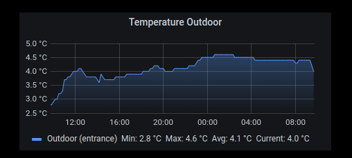

# MMM-GrafanaEmbedded []

Embed panels from grafana (requires grafana v6 or higher)

## Example



## Installatoion
1. `cd ~/MagicMirror/modules`
1. `git clone https://github.com/eirikaho/MMM-SystemStatus.git`
1. `cd MMM-SystemStatus`
1. `npm install`
1. Configure `~/MagicMirror/config/config.js`:

    ```
		{
			module: 'MMM-GrafanaEmbedded',
			position: 'top_right',
			config: {
				id: "",
				host: "",
				port: ""
				dashboardName: "",
				orgId: ,
				panelId: ,
				width: "450",
				height: "200",
				refreshRate: "5m",
				from: "now-24h",
				to: "now"
			}
		},
    ```
url composition example
`http://<host>:<port>/d/<id>/>dashboardName>?orgId=<orgId>&refresh=<refreshRate>&from=<from>&to=<to>&panelId=<panelId>`

for time range syntax (from, to) see [grafana time range controls](https://grafana.com/docs/grafana/latest/dashboards/time-range-controls/)